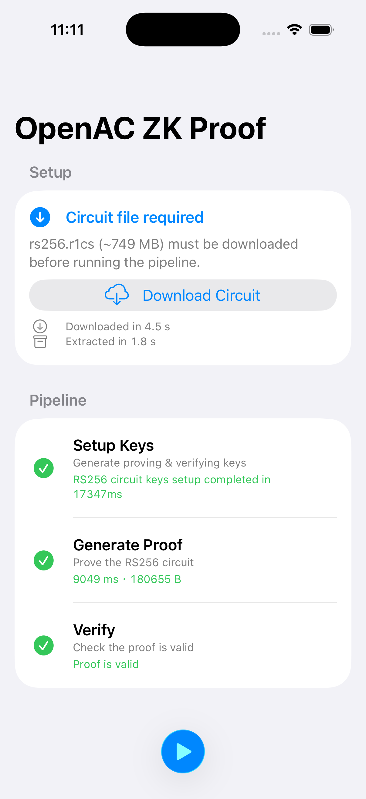

# OpenAC Example App

Sample iOS app that runs the **OpenAC** zero-knowledge pipeline for the RS256 circuit: download the circuit, set up keys, generate a proof, and verify it. It uses **[OpenACSwift](https://github.com/zkmopro/OpenACSwift)**—Swift bindings for OpenAC on iOS.

## Screenshot

The UI walks through circuit download (from the [zkID](https://github.com/zkmopro/zkID) release assets), then **Setup keys** → **Generate proof** → **Verify**, with timings and status for each step.

## Requirements

- iOS 16+
- Xcode 15+

Match the environment expected by [OpenACSwift](https://github.com/zkmopro/OpenACSwift).

## Dependencies

- [OpenACSwift](https://github.com/zkmopro/OpenACSwift) (Swift Package Manager)
- [ZIPFoundation](https://github.com/weichsel/ZIPFoundation) — used to extract the downloaded `rs256.r1cs` archive

## Running the project

1. Open `OpenACExampleApp.xcodeproj` in Xcode.
2. Select an iPhone simulator or device.
3. Build and run. On first use, tap **Download Circuit** if the large `rs256.r1cs` file is not present yet, then run the pipeline (play control) to execute setup, prove, and verify.

Bundled `input.json` is copied into the app’s documents area on first launch for use with `setupKeys` and `prove`, as described in the OpenACSwift README.

## See also

- [OpenACSwift](https://github.com/zkmopro/OpenACSwift) — API, installation, and prebuilt binaries (zkID releases).
