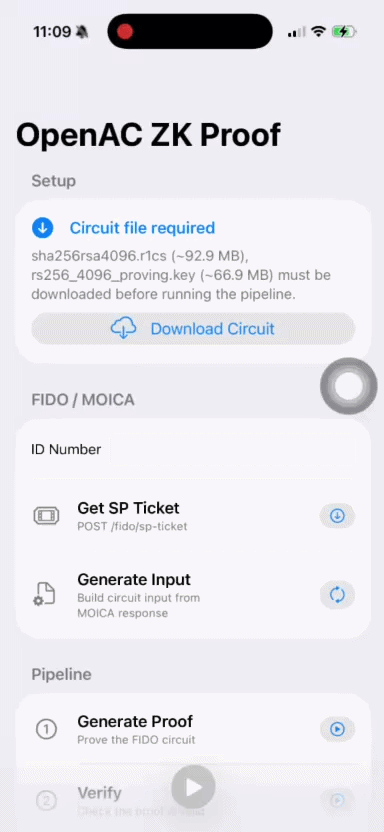
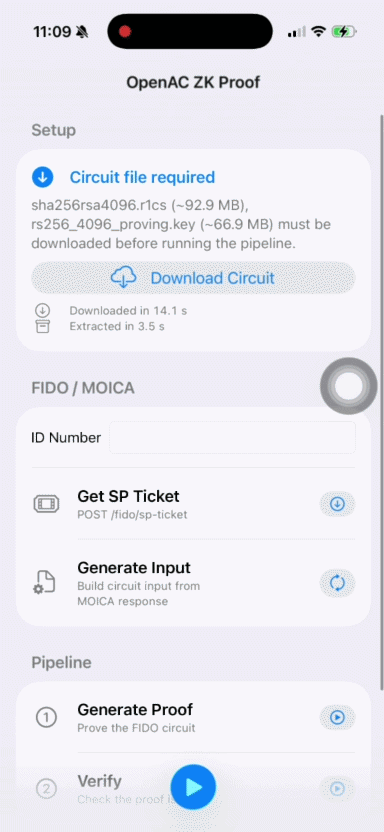
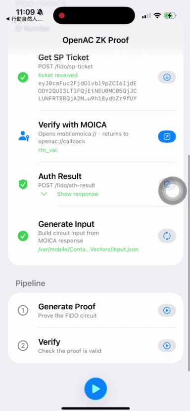

# OpenAC Example App

Sample iOS app that runs the **OpenAC** zero-knowledge pipeline for the FIDO/SHA256RSA4096 circuit: authenticate with Taiwan's MOICA digital signature service, generate a ZK proof, and verify it on-device. It uses **[OpenACSwift](https://github.com/zkmopro/OpenACSwift)**—Swift bindings for OpenAC on iOS.

## Demo

| Download Circuits | Sign with MOICA | Generate Proof |
|:-:|:-:|:-:|
|  |  |  |
| \~10 seconds | \~11 seconds | prove \~ 5 seconds \| verify \~13 seconds |

## How it works

The app walks through four stages:

### 1. Setup — Download Circuit files
Downloads `sha256rsa4096.r1cs` (\~92.9 MB) and `rs256_4096_proving.key` (\~66.9 MB) from cloud storage. The verifying key is fetched on demand when **Verify** is first run. Once downloaded, the Setup section collapses.

### 2. FIDO / MOICA — Authenticate with national ID
| Step | Description |
|---|---|
| **ID Number** | Enter your Taiwan national ID (e.g. `A123456789`) |
| **Get SP Ticket** | Calls `POST /moise/sp/getSpTicket` on `fidoapi.moi.gov.tw` with an AES-256-GCM checksum. Returns a signed `sp_ticket`. |
| **Verify with MOICA** | Deep-links to `mobilemoica://moica.moi.gov.tw/a2a/verifySign` so the MOICA app performs the signature. Returns to `openac://callback` with `rtn_val`. |
| **Auth Result** | Calls `POST /moise/sp/getAthOrSignResult`, polling every 4 s until the signature is available. Retrieves `signed_response` and the signer's certificate. |
| **Generate Input** | Calls `generateInputFido` from OpenACSwift to build `input.json` from the MOICA response, ready for the ZK circuit. |

### 3. Pipeline — ZK proof
| Step | Description |
|---|---|
| **Generate Proof** | Calls `proveFido` — runs the Groth16 prover over the FIDO circuit. Reports proof size and time. |
| **Verify** | Calls `verifyFido` — verifies the Groth16 proof on-device. |

Individual steps can be triggered with their own play button, or tap **Run All Steps** in the toolbar to run the full pipeline in sequence.

## Requirements

- iOS 16+
- Xcode 15+
- MOICA app installed on device for the FIDO authentication flow
- A registered FIDO service ID and matching AES key (see [Secrets](#secrets))

## Dependencies

- [OpenACSwift](https://github.com/zkmopro/OpenACSwift) — Swift bindings for `proveFido`, `verifyFido`, `setupKeysFido`, `generateInputFido`
- [ZIPFoundation](https://github.com/weichsel/ZIPFoundation) — extracts downloaded `.zip` circuit archives
- CryptoKit (system) — AES-256-GCM for the `sp_checksum` required by the FIDO API

## Secrets

The FIDO API requires a service ID and AES key. Create `OpenACExampleApp/Secrets.swift` (gitignored):

```swift
enum Secrets {
    static let fidoSpServiceID = "<your-sp-service-id>"
    static let fidoAESKey      = "<your-aes-key-base64>"
}
```

Both values can also be injected via environment variables `FIDO_SP_SERVICE_ID` and `FIDO_AES_KEY` (useful for CI).

## Running the project

1. Open `OpenACExampleApp.xcodeproj` in Xcode.
2. Add your `Secrets.swift` (see above).
3. Select an iPhone simulator or device.
4. Build and run.
5. On first launch, tap **Download Circuit** in the Setup section and wait for the download to complete (~160 MB total).
6. Enter your ID number, then follow the FIDO / MOICA steps in order.
7. Tap **Run All Steps** (or individual play buttons) to generate and verify the ZK proof.

## See also

- [OpenACSwift](https://github.com/zkmopro/OpenACSwift) — API, installation, and prebuilt binaries
- [zkID releases](https://github.com/zkmopro/zkID/releases) — circuit and key files
